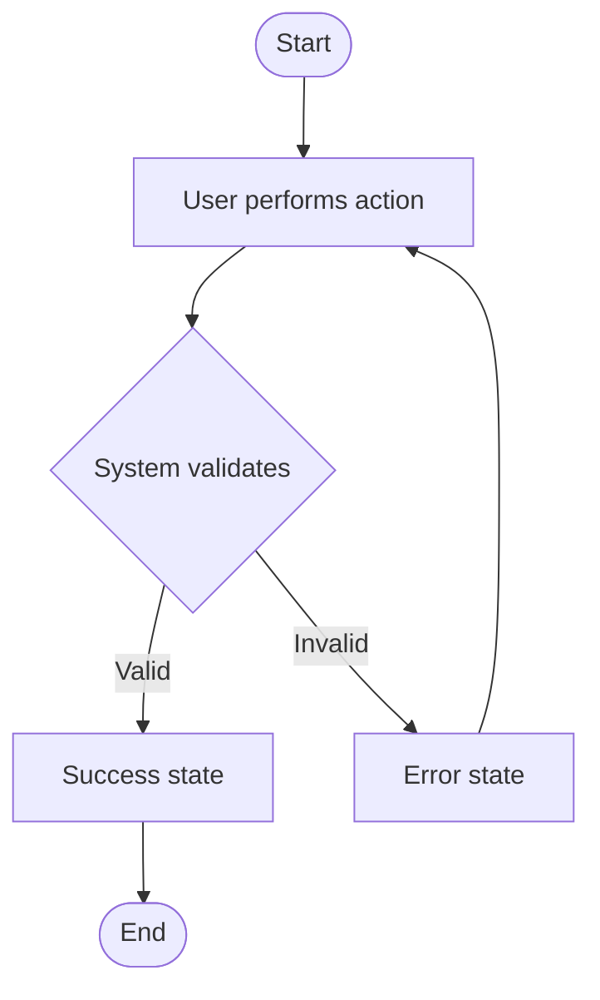

# Use Case: {{SCENARIO TITLE}}

## Preconditions
{{What must be true before this scenario starts?}}

## Main Flow (Happy Path)
1. User {{action}}.
2. System {{response}}.
3. System validates {{condition}}.
4. System returns {{result}}.

## Alternative Flows
- **[ALT-1] {{Condition}}:** {{What happens instead.}}

## Failure Points (→ Fuzzing)
- **[F-1]** {{What can go wrong here? e.g., Invalid input format}}

## User Flow (Mermaid)

## System States
- **Before:** `{{state_before}}`
- **After success:** `{{state_after_success}}`
- **After failure:** `{{state_after_failure}}`

## Linked Tasks
- [ ] [TSK-xxx]({{PATH_TO_TSK}}) — Backend implementation
