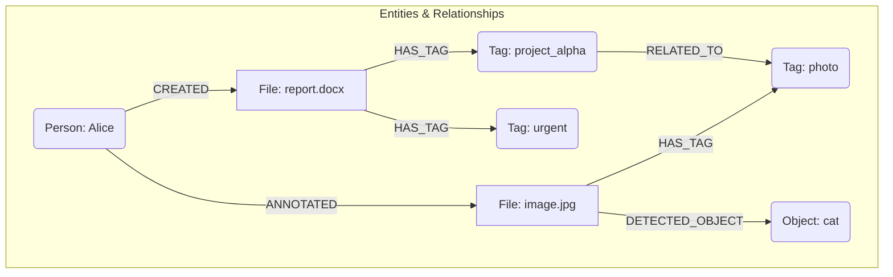

# Graph Module

Этот модуль отвечает за работу с графовыми структурами данных в SLM, позволяя представлять и анализировать связи между различными сущностями (например, файлами, тегами, метаданными).

## Структура модуля

Функциональность графового модуля разделена на следующие поддиректории, указывающие на возможную поддержку различных бэкендов и инструментов:

*   **`neo4j/`**: Содержит код, связанный с использованием графовой базы данных Neo4j. *(Требуется дальнейшее изучение содержимого)*.
*   **`networckx/`** (вероятно, опечатка, должно быть `networkx/`): Содержит код, связанный с использованием библиотеки NetworkX для создания, манипулирования и изучения структуры графов. *(Требуется дальнейшее изучение содержимого)*.
*   **`visualiz/`**: Содержит инструменты или код для визуализации графов. *(Требуется дальнейшее изучение содержимого)*.

*(Общее описание того, как эти компоненты взаимодействуют или какой из них является основным, будет добавлено после анализа содержимого поддиректорий.)*

## Основные концепции

*   **Узел (Node):** Представляет сущность (например, файл, тег, человек, концепция).
*   **Ребро (Edge):** Представляет связь между двумя узлами (например, "файл ИМЕЕТ_ТЕГ тег", "человек СОЗДАЛ файл"). Ребра могут иметь тип и свойства.

## Пример графа (Mermaid)

*(Эта диаграмма показывает возможные типы узлов и связей, управляемых модулем Graph)*.

## Дальнейшая документация

*   [Neo4j Integration](neo4j/index.md) *(Placeholder)*
*   [NetworkX Integration](networckx/index.md) *(Placeholder)*
*   [Visualization Tools](visualiz/index.md) *(Placeholder)*

## Связанные концепции

*   [Core Concepts](../core_concepts.md)
*   [Architecture](../architecture.md)
*   [Files DB Module](../files_db/index.md) (Данные из `files_db` могут быть представлены в графе)
*   [Metadata Module](../metadata/index.md) (Метаданные могут быть свойствами узлов/ребер)
