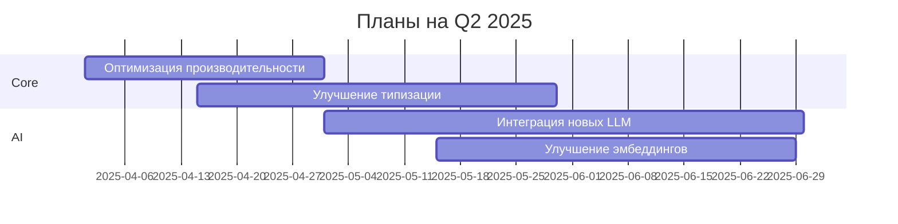
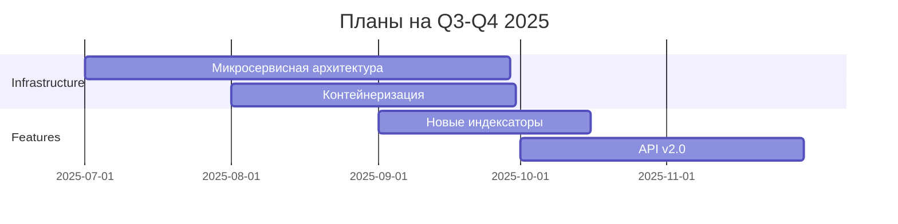

# Планы развития SLM

Этот документ описывает стратегию развития системы SLM, включая планируемые улучшения, новые функции и долгосрочные цели.

## Дорожная карта 2025-2026

### Q2 2025


### Q3-Q4 2025


## Планируемые улучшения

### 1. Архитектурные изменения
- **Микросервисная архитектура**
  ```python
  # Пример нового API
  @service
  class ImageProcessingService:
      async def process(self, image: bytes) -> ProcessingResult:
          pass
  ```
  
- **Асинхронность**
  ```python
  # Новый асинхронный интерфейс
  async def batch_process(items: List[Item]) -> List[Result]:
      tasks = [process_item(item) for item in items]
      return await asyncio.gather(*tasks)
  ```

- **Распределенное хранение**
  ```yaml
  # Конфигурация хранилища
  storage:
    type: distributed
    nodes:
      - host: node1
        capacity: 1TB
      - host: node2
        capacity: 2TB
  ```

### 2. Улучшения производительности

#### Оптимизация памяти
```python
# Использование генераторов
def process_large_dataset(data_path: str):
    for batch in iter_batches(data_path):
        yield process_batch(batch)
```

#### Кэширование
```python
# Интеллектуальное кэширование
@smart_cache(ttl=3600, max_size="1GB")
def expensive_operation(data: bytes) -> Result:
    pass
```

#### Параллелизм
```python
# Параллельная обработка
@parallel(workers=4)
def process_items(items: List[Item]) -> List[Result]:
    pass
```

### 3. Новые возможности

#### Улучшенный AI
```python
# Интеграция с новыми моделями
class MultiModalProcessor:
    def process_image(self, image: Image) -> Description:
        pass
        
    def process_text(self, text: str) -> Summary:
        pass
```

#### Расширенная аналитика
```python
# Аналитические инструменты
class DataAnalyzer:
    def analyze_patterns(self, data: Dataset) -> Patterns:
        pass
        
    def predict_trends(self, history: History) -> Trends:
        pass
```

#### Интеграции
```python
# Новые интеграции
class ExternalServices:
    def cloud_storage(self) -> CloudStorage:
        pass
        
    def ai_services(self) -> AIServices:
        pass
```

## Долгосрочные цели

### 1. Технологические цели
- Полная поддержка Python 3.12+
- Нативная асинхронность
- Распределенная архитектура
- Real-time обработка

### 2. Функциональные цели
- Расширенная поддержка форматов
- Улучшенный поиск по содержимому
- Продвинутая аналитика данных
- Интеграция с внешними сервисами

### 3. Бизнес-цели
- Увеличение производительности
- Снижение требований к ресурсам
- Улучшение масштабируемости
- Расширение экосистемы

## План релизов

### v2.0 (Q4 2025)
```yaml
version: 2.0.0
features:
  - Микросервисная архитектура
  - Асинхронный API
  - Улучшенные AI-компоненты
  - Новая система кэширования
```

### v2.1 (Q1 2026)
```yaml
version: 2.1.0
features:
  - Распределенное хранение
  - Расширенная аналитика
  - Интеграция с облачными сервисами
  - Улучшенная производительность
```

### v2.2 (Q2 2026)
```yaml
version: 2.2.0
features:
  - Real-time обработка
  - Новые AI-модели
  - Расширенная система плагинов
  - Улучшенная безопасность
```

## Исследования и эксперименты

### 1. AI и ML
- Тестирование новых моделей
- Оптимизация инференса
- Улучшение качества эмбеддингов
- Эксперименты с multimodal моделями

### 2. Архитектура
- Тестирование QUIC
- Оценка новых БД
- Эксперименты с WebAssembly
- Исследование edge computing

### 3. Производительность
- Профилирование узких мест
- Тестирование новых алгоритмов
- Оценка альтернативных структур данных
- Анализ паттернов использования

## Вклад в проект

### 1. Как начать
```bash
# Клонирование репозитория разработки
git clone https://github.com/your-org/SLM-dev.git
cd SLM-dev

# Установка зависимостей разработки
pip install -r requirements-dev.txt

# Запуск тестов
pytest tests/
```

### 2. Приоритетные задачи
- Оптимизация производительности
- Улучшение документации
- Исправление багов
- Добавление тестов

### 3. Процесс разработки
- Создание issue
- Обсуждение решения
- Реализация
- Code review
- Тестирование
- Релиз
