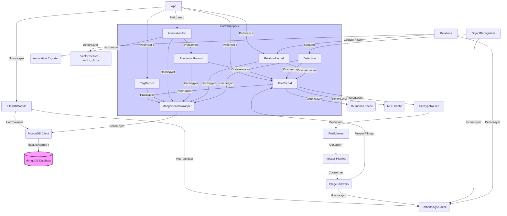

# Архитектура модуля `files_db`

Модуль `files_db` построен вокруг центральной базы данных MongoDB, которая хранит информацию о файлах и связанных с ними сущностях. Взаимодействие с базой данных осуществляется через классы-обертки, наследующие `MongoRecordWrapper`.

## Основные компоненты

1.  **База данных (MongoDB)**: Ядро системы, хранящее документы для различных сущностей. Ключевые коллекции:
    *   `collection_records`: Основная коллекция для `FileRecord`, `Detection`, `Recognized_object` и других, использующих `itemType` для различения.
    *   `tags_records`: Для `TagRecord`.
    *   `relation_records`: Для `RelationRecord`.
    *   `object_class_dict`: Для `DetectionObjectClass`.
    *   `annotation_records`: Для `AnnotationRecord`.
    *   `annotation_jobs`: Для `AnnotationJob`.
2.  **Инициализация (`FilesDBModule`)**: [Главный модуль](./main_module.md), отвечающий за настройку при запуске приложения:
    *   Устанавливает соединение с MongoDB.
    *   Регистрирует коллекции и классы-обертки.
    *   Создает индексы MongoDB для оптимизации запросов.
    *   Инициализирует кэш эмбеддингов (`Embeddings_cache`).
3.  **Классы-обертки (`MongoRecordWrapper`)**: Основной способ взаимодействия с данными в MongoDB. Каждый класс представляет тип документа и предоставляет методы для CRUD операций и специфической логики. Ключевые обертки:
    *   [`FileRecord`](./core_concepts.md#fileRecord-file_record_wraperpy): Для записей о файлах.
    *   [`TagRecord`](./core_concepts.md#tag-record-fs_tagpytagrecord): Для тегов.
    *   [`AnnotationRecord`](./core_concepts.md#annotation-record-annotationpyannotationrecord) и [`AnnotationJob`](./core_concepts.md#annotation-job-annotationpyannotationjob): Для аннотаций.
    *   `RelationRecord`: Для связей между записями.
    *   `Detection`, `Recognized_object`: Для результатов распознавания объектов.
4.  **Определение типа файла (`CollectionRecordScheme`)**: Система (`FileTypeRouter`, `FileScheme`) для определения типа файла по расширению и связывания его с соответствующими операциями, в первую очередь с [Индексаторами](./indexers/index.md).
5.  **Компоненты (`components/`)**: Модули, реализующие специфическую логику для управления связанными данными:
    *   [Каталоги](./components/catalogs.md): Управление коллекциями файлов.
    *   [Связи](./components/relations.md): Поиск дубликатов, управление эмбеддингами и другими связями (`RelationRecord`).
    *   [Веб-ссылки](./components/web_links.md): Управление ссылками на внешние ресурсы.
6.  **Индексаторы (`indexers/`)**: Модули для извлечения метаданных и другой информации из файлов (особенно изображений) и сохранения их в `FileRecord`. Примеры: чтение EXIF, получение тегов из имени файла, DeepDanbooru, LLaVA, детекция лиц.
7.  **Инструмент аннотации (`annotation_tool/`)**: Компоненты для создания задач аннотирования (`AnnotationJob`), управления процессом аннотации (`AnnotationRecord`) и экспорта данных.
8.  **Распознавание объектов (`object_recognition/`)**: Функционал для детекции объектов на изображениях и сохранения результатов (`Detection`, `Recognized_object`).
9.  **Интеграция с векторной БД (`vector_db_ext/`)**: Модуль для взаимодействия с внешней векторной базой данных для поиска по эмбеддингам.
10. **Кэши (`files_data_cache/`)**: Вспомогательные компоненты для кэширования данных, таких как превью изображений (`ImageThumbCache`), эмбеддинги (`Embeddings_cache`), MD5 файлов (`ImageDataCacheManager`).

## Взаимодействие (упрощенно)

[Назад к главной странице](./index.md)
